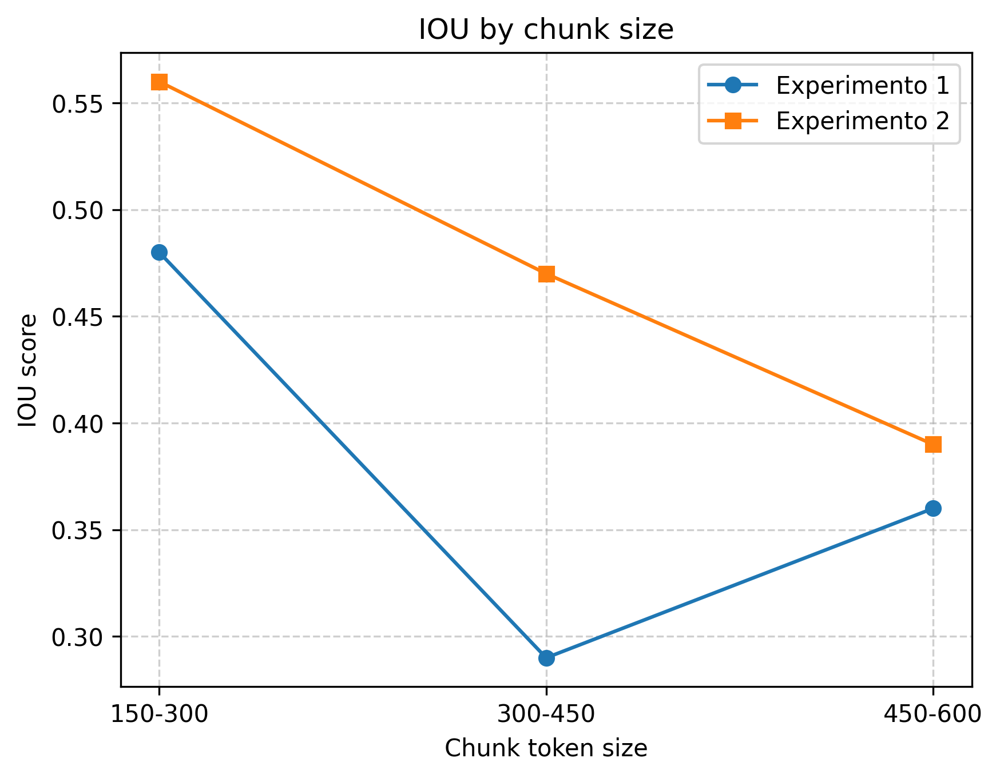
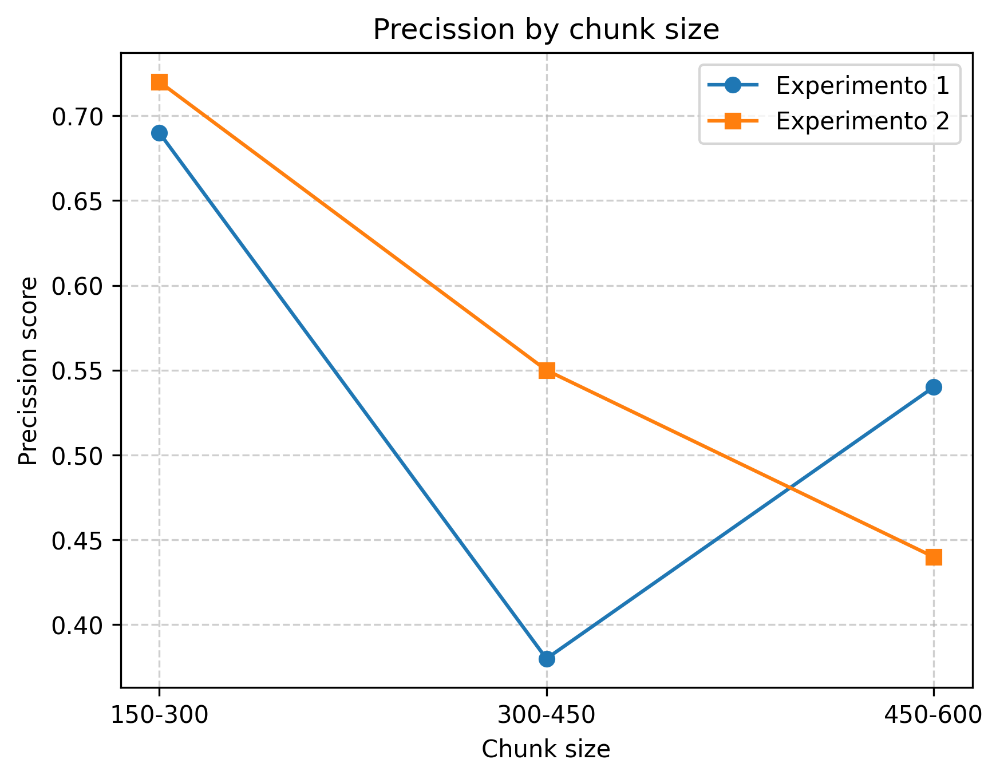
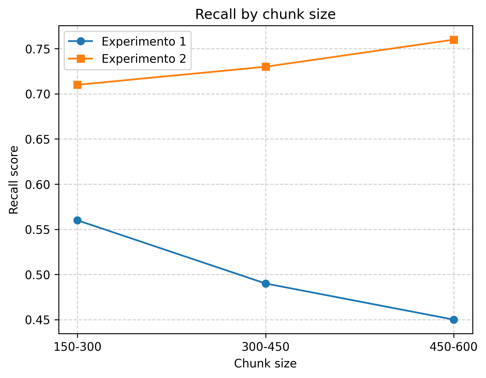

# chunking_system_API


Esta API desarrollada con FastApi expone un endpoint "/process_doc" el cual es capaz de procesar un archivo (pdf, docx, txt) y segmentarlo semánticamente, devolviendo una lista de chunks. Los parámetros posibles a configurar para la segmentación son los siguientes:

```python
splitter_pdf = RollingWindowSplitter(
    encoder=encoder, #intfloat/multilingual-e5-large
    dynamic_threshold=True,
    min_split_tokens=150,
    max_split_tokens=300,
    window_size=5,
    plot_splits=False,  
    enable_statistics=False 
```

🔹 min_split_tokens define el tamaño mínimo de un chunk en tokens.  
🔹 max_split_tokens Define el tamaño máximo del chunk antes de forzar un corte. <br>
🔹 window_size  Controla el overlap semántico entre chunks.  
🔹 dynamic_threshold  Esto ajusta dinámicamente los cortes según la coherencia semántica detectada por el encoder.


Docker image:
docker pull paulbarreda9/chunking-api:latest


El código para la ingesta y procesamiento de documentos se basa fundamentalmente en [MinerU](https://github.com/opendatalab/MinerU) y [semantic-router](https://pypi.org/project/semantic-router/). MinerU es una herramienta de código abierto desarrollada por OpenDataLab, diseñada para facilitar el análisis y procesamiento de documentos complejos, como artículos académicos, informes técnicos y libros de texto y llevarlos a formatos estructurados como Markdown y JSON. Utiliza modelos como DocLayout-YOLO para detectar y estructurar elementos del documento, incluyendo encabezados, tablas, texto y fórmulas. Elimina automáticamente elementos redundantes como encabezados, pies de página y números de página, preservando la coherencia semántica del texto. Convierte fórmulas matemáticas en formato LaTeX, facilitando su edición y análisis. Detecta y extrae tablas, representándolas en formato HTML para su posterior procesamiento.  
Por otro lado semantic-router es usado para implementar directamente la segmentación semántica permitiendo configurar parametros de la segmentación.

Ejemplo para llamar a la API:

```python
 # for txt

import requests
url = "https://wiig.dia.fi.upm.es/chunking/process_doc"


response = requests.post(
    url,
    data={"type_name": "note", "content": content, "language": "es"}
)
chunks = response.json()
chunks
```

```python
 # for pdf

import requests
url = "https://wiig.dia.fi.upm.es/chunking/process_doc"


response = requests.post(
    url,
    files={"file": open( "/home/peyzaguirre/notebooks/dev_chunking_system/table.pdf", "rb")},
    data={"type_name": "pdf","output_dir":"/home/peyzaguirre/notebooks/dev_chunking_system/output", "language":"es"}
)
chunks = response.json()
```

```python
 # for doc

response = requests.post(
    url,
    files={"file": open( "/home/peyzaguirre/notebooks/dev_chunking_system/Carta.docx", "rb")},
    data={"type_name": "doc","output_dir":"/home/peyzaguirre/notebooks/dev_chunking_system/output", "language":"es"}
)
chunks_doc = response.json()
chunks_doc[0]
```

NOTE: type_name can be "note", "pdf", "docx". The endpoint enabled for testing purposes (inside the VPN of UPM) is "https://wiig.dia.fi.upm.es/chunking/process_doc"

## EVALUACIÓN


Partiendo de que uno de los principales objetivos de un sistema de recuperación en aplicaciones de IA es identificar y recuperar únicamente los tokens relevantes para una consulta determinada, proponemos una estrategia de evaluación que mide a nivel de token la efectividad de la estrategia de segmentación utilizada en el retrieval. Las métricas utilizadas son precisión, recuperación e intersección sobre unión ( [índice Jaccard](https://en.wikipedia.org/wiki/Jaccard_index) ) a partir de los tokens recuperados .

Gneración de conjunto de datos:

Para el experimento 1, hemos utilizado un dataset pequeño que consiste en una consulta generada manualmente sobre un documento de caracter legal, y un pasaje o párrafo del documento que responde a dicha consulta. Por ejemplo:

<pre> ```
Cosulta generada por un humano : "¿cuales son las reglas que las administraciones publicas deben ajustarse para  garantizar la identidad y contenido de las copias electrónicas o en papel? "
Extracto sacado del documento =   Para garantizar la identidad y contenido de las copias electrónicas o en papel, y por tanto su carácter de copias auténticas, las Administraciones Públicas deberán ajustarse a lo previsto en el Esquema Nacional de Interoperabilidad, el Esquema Nacional de Seguridad y sus normas técnicas de desarrollo, así como a las siguientes reglas: 
a) Las copias electrónicas de un documento electrónico original o de una copia electrónica auténtica, con o sin cambio de formato, deberán incluir los metadatos que acrediten su condición de copia y que se visualicen al consultar el documento. 
b) Las copias electrónicas de documentos en soporte papel o en otro soporte no electrónico susceptible de digitalización, requerirán que el documento haya sido digitalizado y deberán incluir los metadatos que acrediten su condición de copia y que se visualicen al consultar el documento. 
c) Las copias en soporte papel de documentos electrónicos requerirán que en las mismas figure la condición de copia y contendrán un código generado electrónicamente u otro sistema 
...

``` </pre>

## MÉTRICAS


### IOU

Para una consulta relacionada a un corpus específico, solo un subconjunto de tokens dentro de ese corpus será relevante. Idealmente, un sistema de recuperación debería recuperar exactamente y únicamente los tokens relevantes para cada consulta en todo el corpus. La metrica Intersección sobre Unión (IoU) es una métrica que considera no solo si se recuperan fragmentos relevantes, sino también cuántos tokens irrelevantes, redundantes o distractores se recuperan.

$$
\text{IoU}_q(\mathbf{C}) = \frac{|t_e \cap t_r|}{|t_e| + |t_r| - |t_e \cap t_r|}
$$


Donde:
- \( t_e \): conjunto de tokens esperados o relevantes (ground truth).
- \( t_r \): conjunto de tokens recuperados por el sistema.
- \( q_i \): query
- \( C \): Chunked corpus

Interpretación:   Si el sistema recupera exactamente los mismos tokens que los relevantes → IoU = 1. Si no hay solapamiento → IoU = 0

### Precision

$$
\text{Precision}_q(\mathbf{C}) = \frac{|t_e \cap t_r|}{ |t_r| }
$$

Interpretación: mide cuántos de los tokens recuperados eran realmente relevantes. (se ven cuanto ruido o falsos positivos hay en la recuperacion).


### Recall

$$
\text{Recall}_q(\mathbf{C}) = \frac{|t_e \cap t_r|}{ |t_e| }
$$

Interpretación:  mide cuántos de los tokens relevantes fueron efectivamente recuperados.


## Resultados

El experimento 1 se enfoca en evaluar los parámetros de configuración estandar, mientras que el experimento 2 incorpora un enfoque recursivo, donde primero divide un documento en segmentos usando los titulos como límite de corte y continúa con la división semántica para cada segmento. Se observa que este último experimento mejora la recuperación de las consultas. En las gráficas se muestra además el resultado obtenido con diferentes tamaños de chunks.

<p align="center">
  
</p>


<p align="center">
  
</p>


<p align="center">
  
</p>


